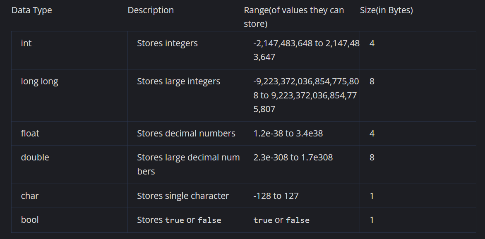
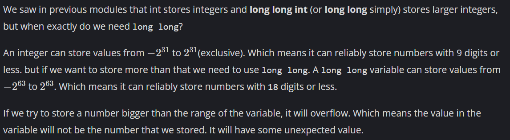

## Variables

A variable is like a labeled box where you can store data. Imagine you have a box labeled "age" and you put the number 25 in it. In C++, you would do this by writing int age = 25;. This means you're storing the number 25 in the variable named age.

int denotes that we will be storing integers (numbers) in this variable.

Here's the cool part: whenever you use age in your code, C++ will remember it is 25. For example, if you write cout << age, C++ will show 25.

## Declaring a variable

When we declare a variable, we should also specify what type of variable it is. This is known as data type, basically meaning what type of data we are going to store in a variable.

Here are all the major data types and what they store in C++:



Example declarations

```cpp
int num = 100000;
long long large_num = 100000000000000;
float pi = 3.14;
double euler_number = 2.718281828459045;
char c = 'A';
bool check = true;
```

Note: In computer memory, a bit is the smallest unit of data, representing a binary digit with values 0 or 1, whereas a byte consists of 8 bits and is used to represent and store data in memory.

## Properties of variables

We learned that variable is a labelled box which can store many different types of values. You can also change the value of a variable in your code.

For example

```cpp
int age = 25;
cout<<age;

// Update age
age = 26;
cout<<age;
```

The above code will output

```cpp
25
26
```

We are going to use variables all the time in the coming lessons. So let's learn a few more stuff about them.

Rules for C++ variable names:

- A variable name can only contain alphabets, numbers and underscores (ie. A-Z, a-z, 0-9, and _).
- A variable name cannot start with a number.
- A variable name cannot have spaces in between.
- Variable names are case-sensitive (age, Age and AGE are three different variables).
- Variable names cannot be any of the reserved keywords in C++ (e.g., int, float, while, class, return, etc.). These keywords have special meanings in the language and are used to define the syntax and structure of C++ programs.

Be sure to follow these rules when creating a variable to not get errors.

## Bool Datatype

In programming, you often need to know if something is true or false. \
For this, we can have variables containing just one of these two values - True or False. \
When the value is returned or printed, true = 1 and false = 0. \
These variables are called "bool" or "boolean variables". \
We will look at applications of these in later modules.

Example 

```cpp
bool var = true;
```

## Negative Numbers

In C++, when you divide an int by another int, you get only the integer value of the quotient and the fractional part gets truncated.

- For example, 3 / 2 would be 1, and not 1.5.
- The fractional part 0.5 gets truncated/discarded.

## Need of long long



## Need of double

Similarly to int and long, we previously saw that float is used to store decimal values and double is used to store bigger decimal values. Let's see exactly how big. \
A float can store up to 7 significant decimal digits accurately. It can store bigger values but not accurately. The value will not be precise. To store bigger values accurately, we use double which can store up to 16 significant decimal digits

## Fixed and setprecision modifiers

- Run the code in the code editor and observe the output.
- In the first line you see a number in scientific notation(9.15235e+06). With big decimal numbers the program generally outputs it in scientific notation. We can change this using fixed modifier(Observe line 7). This allows us to output numbers in fixed-point notation which we are generally familiar with.
- Usually in fixed-point notation we get 6 digits after the decimal point. This can also be changed by the setprecision modifier(Observe line 8). We can define how many digits we want after the decimal point. Observer in the code editor we set this value to 9 which allows us to get 9 digits after the decimal point.

Code:

```cpp
#include <bits/stdc++.h>
using namespace std;

int main() {
    double num = 9152345.6789118;
    cout<<num<<endl;
    cout<<fixed<<num<<endl;
    cout<<setprecision(9)<<num<<endl;
}
```

Output:
```cpp
9.15235e+06
9152345.678912
9152345.678911800
```

## Type conversion

Previously, we saw different types of datatypes. We can also convert one data type to another as per our use. This is called Type Conversion.

There are two types of Type Conversion.

- `Implicit Type Conversion` - Here C++ automatically converts a variable or a value to the appropriate datatype itself.

```cpp
int x = 7;
float y = x;
```

Here we declare `x` as an integer and initialize it to `7`. Then we declare another float variable and set it's value to `x` which is an integer. Here the integer `7` which is stored in `x` is converted to a float and stored in `y` as `7.0`.

- `Explicit Type Conversion` - Here we manually convert a value to another type of data as per our use.

```cpp
float num = 7.89;
cout<<int(num)<<endl;
```

Here we declare a float with value `7.89`. Then we convert it to integer the output it. This converts `7.89` to integer and outputs `7`.

Converting different types of variables

Code:

```cpp
#include <bits/stdc++.h>
using namespace std;

int main() {
    cout<<"float to integer - 17.84 changes to -> "<<int(17.84)<<endl;
    cout<<"integer to float - 2 changes to -> "<<float(2)<<endl;
    cout<<"integer to char - 68 changes to -> "<<char(68)<<endl;
    cout<<"char to integer - C changes to -> "<<int('C')<<endl;
    cout<<"integer to boolean - 158 changes to -> "<<bool(156)<<endl;
    cout<<"boolean to integer - false changes to -> "<<int(false)<<endl;
  return 0;
}
```

Output:

```txt
float to integer - 17.84 changes to -> 17
integer to float - 2 changes to -> 2
integer to char - 68 changes to -> D
char to integer - C changes to -> 67
integer to boolean - 158 changes to -> 1
boolean to integer - false changes to -> 0
```

## Understanding integer to boolean conversion

In the previous problem we observed how an integer 156 when converted to boolean gave true.

Let's understand how the boolean value is determined when converted from an integer.

To understand this, we just need to understand one simple rule - 0 is false, and anything other than 0 is true.

It doesn't matter if it is a negative number or a decimal number. Everything other than 
0 will be converted to true, which is outputted as 1. Only 0 is converted to false which is outputted as 0.

Code:

```cpp
#include <bits/stdc++.h>
using namespace std;

int main() {
    cout<<bool(0)<<endl;
    cout<<bool(1)<<endl;
    cout<<bool(720)<<endl;
    cout<<bool(-83)<<endl;
    cout<<bool(0.0000003)<<endl;
    
  return 0;
}
```

Output:

```txt
0
1
1
1
1
```

## Ascii

In the previous sub-module we learned about type conversion and observed how characters when converted to integers had a specific value. We observed that when we converted 'C' to integer it gave 67 and when we converted 68 to character it gave 'D'.
This is because each character has an integer value also known as it's ASCII value.

Note: Since lower case letters and upper case letters are different characters they have different ascii values.

Run the code the observe the ascii values of different characters.

Code:

```cpp
#include <bits/stdc++.h>
using namespace std;

int main() {
    cout<<"a->"<<int('a')<<endl;
    cout<<"b->"<<int('b')<<endl;
    cout<<"c->"<<int('c')<<endl;
    cout<<"..."<<endl;
    cout<<"z->"<<int('z')<<endl;
    cout<<endl;
    cout<<"A->"<<int('A')<<endl;
    cout<<"B->"<<int('B')<<endl;
    cout<<"C->"<<int('C')<<endl;
    cout<<"..."<<endl;
    cout<<"Z->"<<int('Z')<<endl;
    cout<<endl;
    cout<<"0->"<<int('0')<<endl;
    cout<<"1->"<<int('1')<<endl;
    cout<<"2->"<<int('2')<<endl;
    cout<<"..."<<endl;
    cout<<"9->"<<int('9')<<endl;
}
```

Output:

```txt
a->97
b->98
c->99
...
z->122

A->65
B->66
C->67
```

## Character Operations

As characters are stored in integer form, we can also manipulate characters using arithmetic operations.

```cpp
cout<<char('a'+1);
```

As 'a' is stored as 97 and 'b' is stored as '98'. If we perform 'a'+1 and convert this to character. we get 'b' as the output.

```cpp
cout<<char('b'-1);
```

Similarly if we subtract 1 from 'b' and convert it to a character we get 'a'.

## Converting upper case characters to lower case

As we saw in the previous problems we can perform arithmetic operations on characters. Since the ascii values of characters are in the same order as the characters of both lower case and upper case characters, we can even convert upper case letters to lower case letters. \
The ascii values of upper case letters lies between 65 and 90 with 65 being 'A' and 90 being 'Z'. \
Similarly the ascii values of lower case letters lies between 97 and 122. With 97 being 'a' and 122 being 'z'. \
Thus, we can convert 'A'(65) to 'a'(97) by adding 32.

```cpp
char ch = 'A';
cout<<char(ch+32)<<endl;
```

This will output

```txt
a
```

We don't need to remember this value to be added to convert a upper case letter to lower case.
This is just the difference between the ascii values of lower case letters and their upper case counter-parts.
Observe the code in the code editor to see how we can calculate this difference and use it to convert a letter from upper case to lower case.

```cpp
#include <bits/stdc++.h>
using namespace std;

int main() {
    char ch = 'D';
    char lower_case = char(ch + ('a'-'A'));
    cout<<lower_case<<endl;
}
```

Output:

```txt
d
```

## Lower to upper case

Similar to the previous case, to convert a lower case letter to upper case letter we just need to add the difference of upper case letters and lower case letters.

Task:
You are given a lower case character ch. Output it in upper case.

```cpp
#include <bits/stdc++.h>
using namespace std;

int main() {
    char ch = 'r';
    char upper_case = char(ch - ('r'-'R'));
    cout<<upper_case<<endl;
}
```