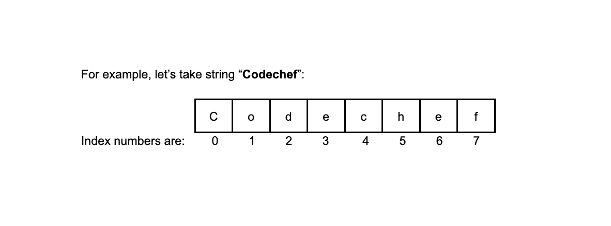

## Creating a String

Strings are used for storing text.

A string variable contains a collection of characters surrounded by double quotes. Before declaring a variable as string the string datatype must be used.

For example:

```cpp
string name = "Chef";
```

We print string like we print any other variable.

```cpp
string name = "Chef";
cout << name;
```

## Concatenation

The '+' sign can be used between strings to add them together to make a new string.
This is called concatenation.

For example:

```cpp
string x = "Good"; 
string y = "Work";
cout << x + y;
// output will be: GoodWork
```

Note: You can add spaces between words by using an empty double quotes ("") with a space inside or by providing a space in the end of a word.

For example:

```cpp
string x = "Good"; 
string y = "Work";
cout << x + " " + y;
// output will be: Good Work
```

## Strings and Integers

C++ uses the + sign for both addition and concatenation.

- Numbers are added.
- Strings are concatenated.
- We cannot mix the two.

## String length

We can use the length() function to get the length of a string.

For example:

```cpp
string s = "hello";
int a = s.length(); // a now stores the length of s
```

## Printing Characters From a String

We can access the characters in a string by referring to its index number inside square brackets [ ]. \
We use the concept of indexing which means every character in a string corresponds to a number called the index number.



Note:

- Indexing always starts from 0 when going left to right.
- So the first character of a string s is s[0], the second is s[1], and so on.

## Changing Characters in a String

To change the value of a specific character in a string

- We refer to the index number to access the specific character by using the indexing operator []
- We then assign the new character (enclosed in single quotes ' ' ) to it.

For example

```cpp
string myString = "Chaf";
myString[2] = 'e';

cout << myString;

// Output:
// Chef
```

Here we changed the character at index 2 of "Chaf" which is 'a' with 'e'. Remember indexing always starts from 0.

## Substring

A substring is a small part of a string. \
For example: \
"World" is a substring of the string "Hello World!"
In C++, the substr() is a string function which is used to extract a substring from a given string.

We takes two values:

- the starting index of the substring
- the number of characters in the substring

```cpp
string str = "Hello, World!";
cout<<str.substr(7, 5);
```

This outputs

```cpp
World
```

It goes to the seventh index which is 'W' and takes 5 characters starting from 'W', which results in 'World'.
We can even give only the starting index to the substr function.
In that case it will start from the starting index and go till the end of the string.

```cpp
string str = "Hello, World!";
cout<<str.substr(5);
```

This outputs

```cpp
, World!
```

as it starts from the fifth index which is ',' and goes till the end of the string.

Please note that if we provide invalid starting index, the program will throw an error.